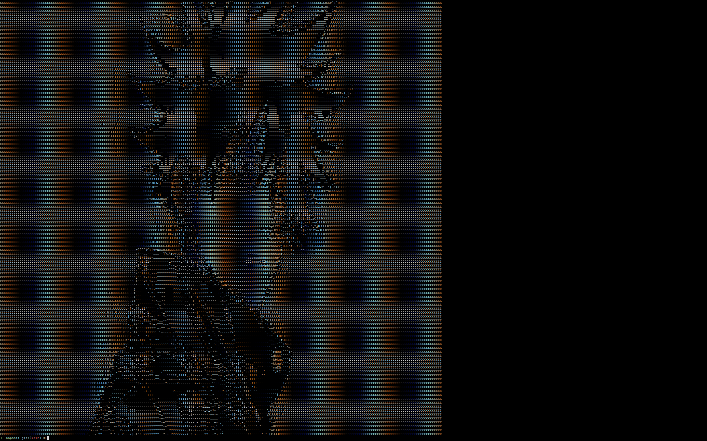

## Capscii
- ASCII representation of camera feed (starting with random images)

## current status:

    
    

## TODO:
- [x] load images
- [x] get brightness value of each pixel. (used weighted luminosity values)
- [x] map brightness value to ascii character
- [x] display ascii character in terminal
